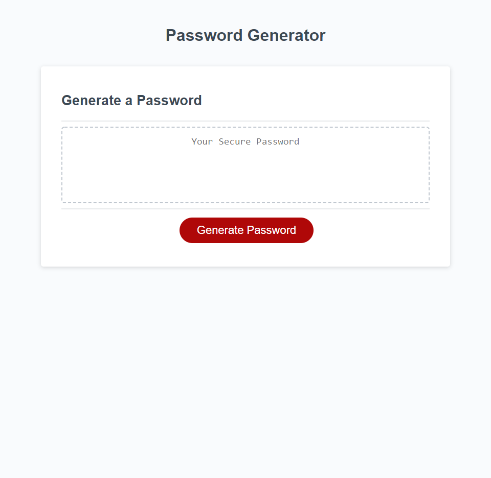

# 03 Password Generator

## **Description**

This is a random password generator that takes input from the user and uses that input to create a random, unique password. 

Users are prompted to click the "Generate Password" button to begin. They are then asked how many characters they want to use. If they chose something outside the valid length range they are given an alert "Password Length Invalid". Next, they are asked if they want to include upper case letters, lower case letters, numbers, or special characters. Finally, based on the user's input for password criteria, the random password should be generated in the password box.   

   

View Application: [Password Generator](https://logan-bonnesen.github.io/03-Password-Generator)